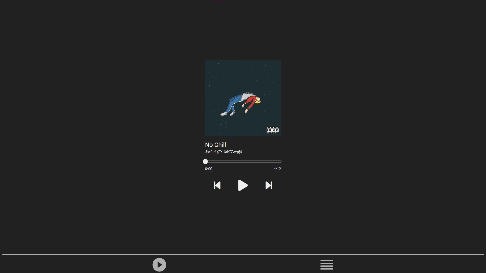
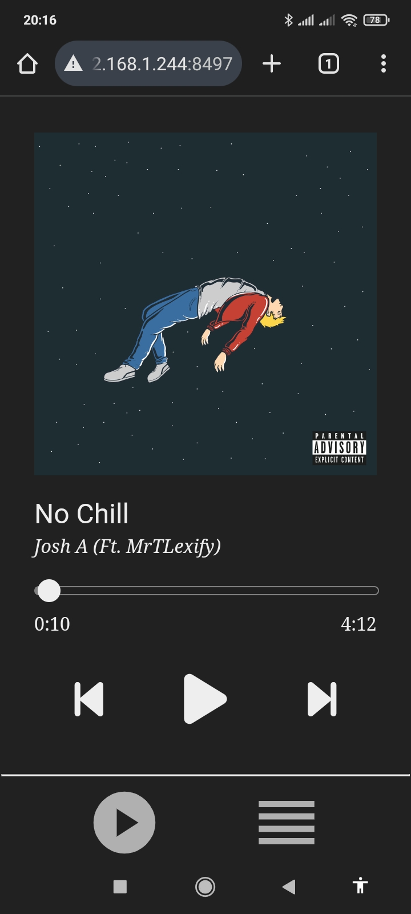
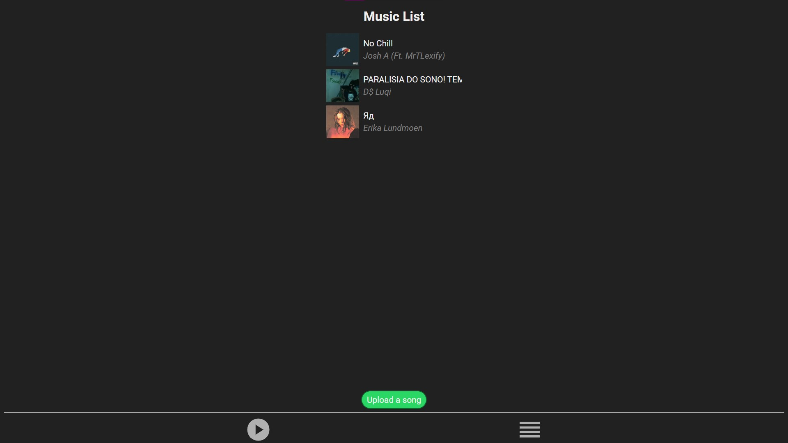

# Bobify

Bobify is a simple music player.

<div class="showing-images" display="flex" flex-direction="column" gap="10px">
    </img>
    <div class="mobile-images" display="flex" gap="1%">
        </img>
        </img>
    </div>
    </img>
</div>

<details>
  <summary><h2>⚙️ Running locally for development</h2></summary>

Start cloning Bobify:

```
git clone https://github.com/staxhinho/Bobify.git
```


Next, install its dependencies (make sure npm is installed on your machine):

```
npm install
```

To start, run:

```
npm start
```

</details>