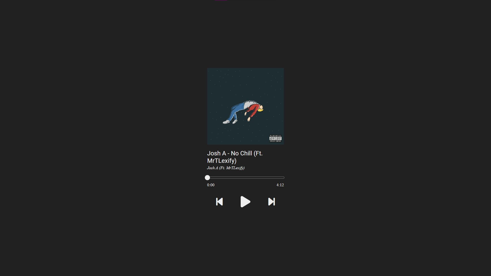

# Bobify

Bobify is a simple music player.

</img>

## Using

Start a server so that the Json file can be fetched.

If you don't know how to do it you can simply use <a href="https://marketplace.visualstudio.com/items?itemName=ritwickdey.LiveServer">Live server</a> extension for Visual Studio Code.